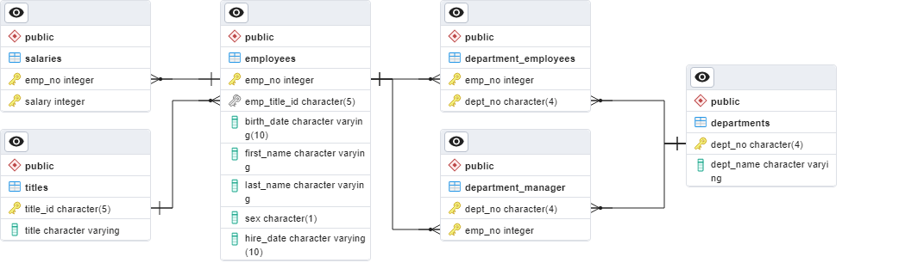

### Pewlett Hackard Employee History Project

I work as a data engineer for Pewlett Hackard (a fictional company). I have
been tasked with doing a research project about people whom the company
employed during the 1980s and 1990s. All that remains of the employee database
from that time are six CSV files.

##### Data Modeling
The following ERD describes the relationship between the CSV files:

##### Data Engineering
I created a table schema for each of the six CSV files.

##### Data Analysis
I was tasked with the following queries:
1. List the employee number, last name, first name, sex, and salary of
each employee.
2. List the first name, last name, and hire date for the employees who
were hired in 1986.
3. List the manager of each department along with their department
number, department name, employee number, last name, and first
name.
4. List the department number for each employee along with
that employee’s employee number, last name, first name, and
department name.
5. List first name, last name, and sex of each employee whose first
name is Hercules and whose last name begins with the letter B.
6. List each employee in the Sales department, including their
employee number, last name, and first name.
7. List each employee in the Sales and Development departments,
including their employee number, last name, first name, and
department name.
8. List the frequency counts, in descending order, of all the employee
last names (that is, how many employees share each last name).
